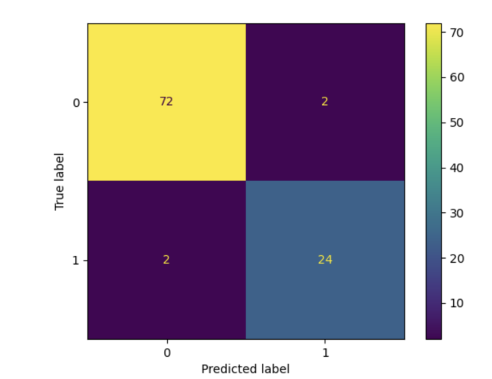
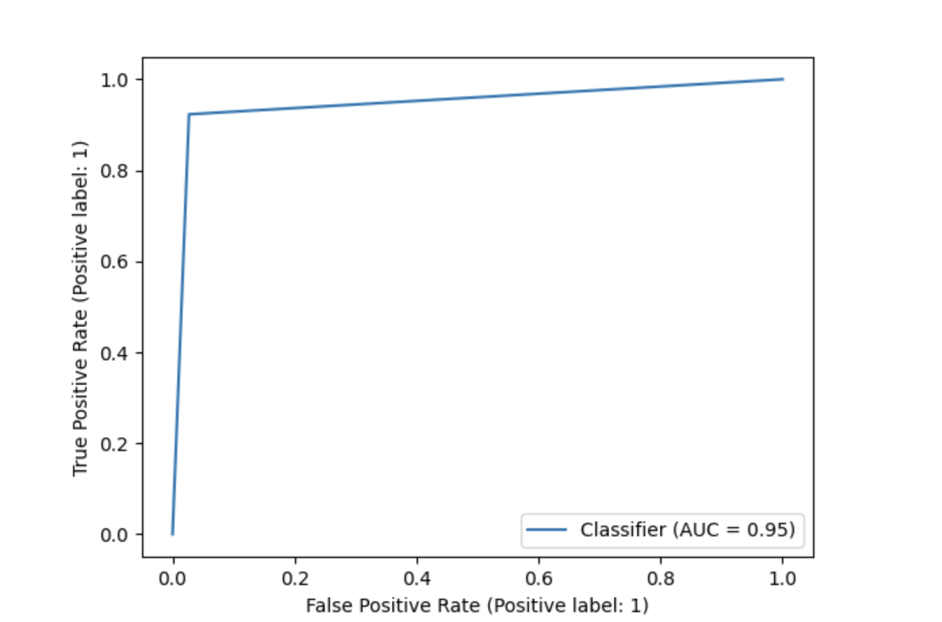
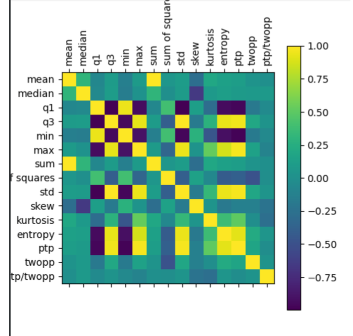

# EEG Signal Analysis for Epilepsy Detection
This project focuses on the analysis of EEG (Electroencephalogram) signals from individuals, aiming to distinguish between normal and epilepsy-afflicted subjects. We process EEG data from the [Bonn Dataset](https://www.upf.edu/web/ntsa/downloads/-/asset_publisher/xvT6E4pczrBw/content/2001-indications-of-nonlinear-deterministic-and-finite-dimensional-structures-in-time-series-of-brain-electrical-activity-dependence-on-recording-regi?inheritRedirect=false&redirect=https%3A%2F%2Fwww.upf.edu%2Fweb%2Fntsa%2Fdownloads%3Fp_p_id%3D101_INSTANCE_xvT6E4pczrBw%26p_p_lifecycle%3D0%26p_p_state%3Dnormal%26p_p_mode%3Dview%26p_p_col_id%3Dcolumn-1%26p_p_col_count%3D1) and employ various data preprocessing, feature extraction, and classification techniques to achieve this objective.

## Project Steps
1. Preprocessing
We begin by applying signal processing techniques to clean and prepare the EEG data for further analysis. This includes filtering, noise reduction, and artifact removal to enhance the quality of the signals.

2. Feature Extraction
To differentiate between normal and epilepsy EEG signals, we extract a range of informative features from the data. These features are computed for each EEG signal and include:

 - Mean
 - Median
 - Q1 (1st Quartile)
 - Q3 (3rd Quartile)
 - Min
 - Max
 - Sum
 - Sum of Squares
 - Standard Deviation
 - Skewness
 - Kurtosis
 - Shannon Entropy
 - Difference between Min and Max Value
 - Difference between Index of Min and Max Value
3. Binary Classification
We perform binary classification using machine learning algorithms based on the extracted features. Several classification algorithms are tested, including:

 - Support Vector Machine (SVM)
 - Random Forest
 - k-Nearest Neighbors (KNN)

Our results indicate that the Random Forest algorithm, with a depth of five, yields the best performance in distinguishing between normal and epilepsy EEG signals with 97% accuracy.

4. Feature Selection
To optimize our model's performance and address the question of whether all extracted features are necessary, we perform feature selection. We compute the correlation between each feature and identify those that do not significantly contribute to the classification. We employ a Decision Tree Classifier to iteratively select the best set of features. Surprisingly, our results show that the Q1 feature alone can achieve an accuracy of 92%, while a selected set of features, including 'Q1', 'ptp/twopp', 'sum', 'twopp', 'median', 'kurtosis', 'sum of squares', 'skew', 'mean', and 'max', can achieve an accuracy of 97%.

5. Clustering Before Classification
We experiment with clustering the data prior to classification to further improve accuracy. By using K-Means clustering with k=5, we group the data into clusters and then perform classification within each cluster. We aggregate the results, and this approach yields an accuracy of 96%.